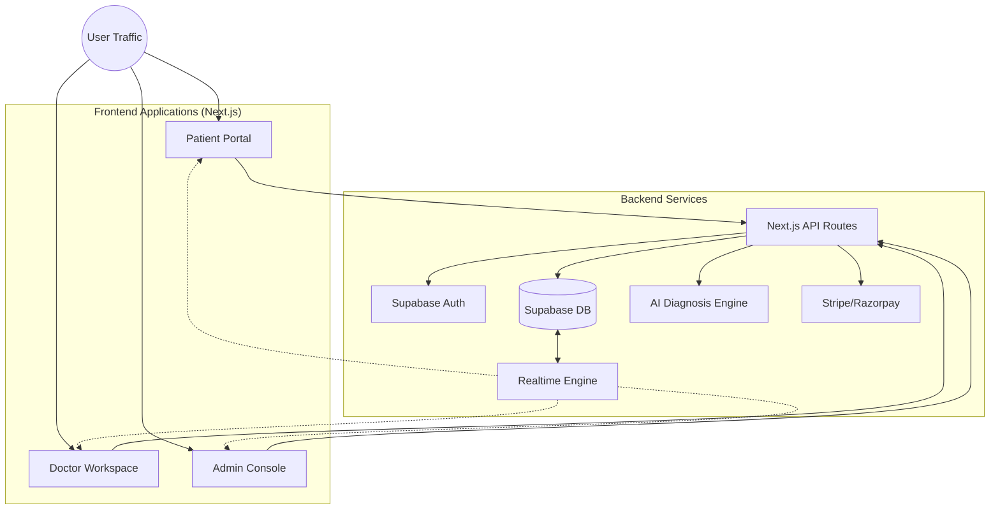

# Healio.AI Mindmap - Master Architecture
## System Overview & Data Flow

---

## 🏛️ HIGH-LEVEL ARCHITECTURE



---

## 🔄 CORE LIFECYLCE: THE CONSULTATION LOOP

This flow demonstrates how data moves through all 3 portals during a standard medical consultation.

### **1. DISCOVERY & TRIAGE (Patient)**
1. **Patient** logs in (`/dashboard`).
2. **Patient** starts AI Consult (`/dashboard/consult`).
3. **AI Engine** analyzes symptoms -> creates `ConsultationRecord`.
4. **Patient** searches for Specialist (`/dashboard/search`).
5. **Patient** books slot & pays (`/api/bookings`).

### **2. CLINICAL ACTION (Doctor)**
6. **Doctor** receives Alert (`/doctor/inbox`).
7. **Doctor** reviews `ConsultationRecord` (AI insights).
8. **Doctor** joins Video Call (`/doctor/schedule`).
9. **Doctor** completes session -> issues `Prescription`.

### **3. OVERSIGHT & SETTLEMENT (Admin)**
10. **Admin** dashboard updates GMV (`/admin`).
11. **System** generates `Invoice`.
12. **Admin** approves Payout (`/admin/invoices`).
13. **Doctor** receives funds.

---

## 🧩 ENTITY RELATIONSHIP MAP (Simplified)

```
[Users] 
   |
   +---< [Profiles] >---+
   |                    |
[Patients]          [Doctors]
   |                    |
   |                    +---< [Availability]
   |                    |
   +---< [Appointments] >---+
   |                        |
   +---< [Consultations] >--+
   |                        |
   |                    [Invoices]
   |                        |
   +---< [Transactions] >---+
```

---

## 📌 KEY ARTIFACTS INDEX

| Phase | Focus Area | File Path |
|-------|------------|-----------|
| **Phase 1** | **Authentication** | `phase1-auth-flow.md` |
| **Phase 2** | **Admin Control** | `phase2-admin-dashboard.md` |
| **Phase 3** | **Doctor Ops** | `phase3-doctor-dashboard.md` |
| **Phase 4** | **Patient Hub** | `phase4-patient-dashboard.md` |
```
